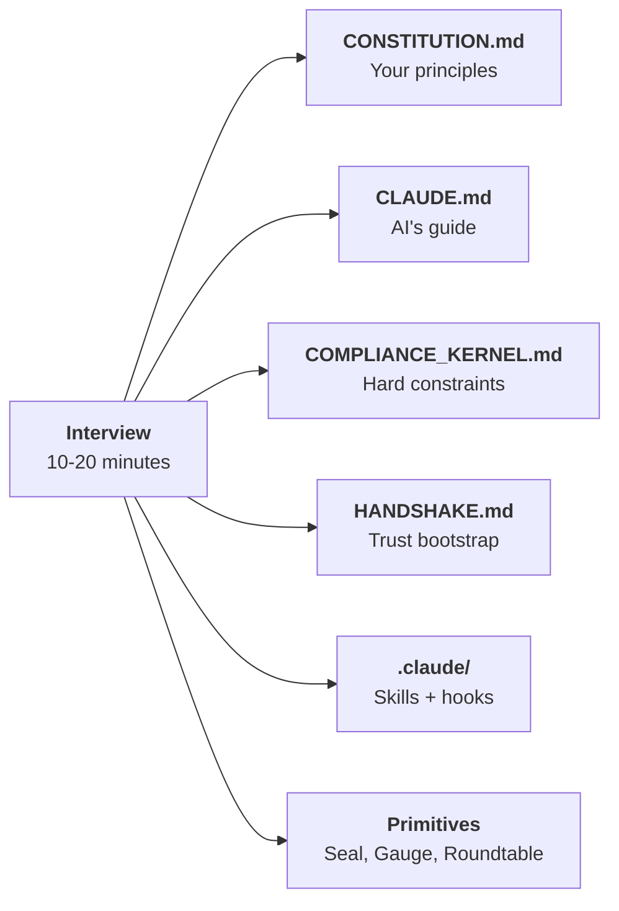

# Gordo Forge

**Create a human-AI collaboration hub in 15 minutes.**

 

---

## Start Here

**Ready to try it?** Jump to [Try It Now](#try-it-now).

**Want to understand first?** Keep reading.

**Skeptical?** See [What's the Catch?](#whats-the-catch)

---

## What Is a Hub?

A hub is a collaboration space between one human and one AI, governed by principles you both agree to.

It's not a template you fill in -- it's a conversation that produces a working constitution: how you'll make decisions together, what requires consent, what the AI can do autonomously, and how trust develops over time.

Forge runs that conversation and writes the files. The interview takes 10-20 minutes.

---

## Who Is This For?

Two entry questions:

1. *"I want to try structured human-AI collaboration but don't know where to start."*

2. *"I want a constitution for my AI collaboration but don't want to write one from scratch."*

If either resonates, Forge is for you.

---

## How It Works



You answer questions. Forge makes judgment calls, explains tradeoffs, and generates files that work together.

---

## Try It Now

**Prerequisites:** Git and [Claude Code](https://claude.ai/code) (Anthropic's CLI for Claude).

```bash
# Install the plugin
git clone https://github.com/jkraybill/gordo-forge.git ~/gordo-forge

# Start Claude Code with Forge loaded
claude --plugin-dir ~/gordo-forge
```

Then ask Claude to help you create a hub. You can say "help me start a collaboration hub" or use the shortcut `/gordo-forge:new-hub`.

---

## What You'll Get

Forge writes a coherent set of files based on your answers:

- **CONSTITUTION.md:** Principles for your collaboration, sized to your needs
- **CLAUDE.md:** The AI's operational guide
- **COMPLIANCE_KERNEL.md:** Non-negotiable constraints
- **HANDSHAKE.md:** Bilateral trust bootstrap
- **.claude/:** Skills, hooks, and settings

Plus optional primitives if you want them:
- **Seal:** Verifiable bilateral consent records
- **Gauge:** Trust calibration and earned autonomy
- **Roundtable:** External review that catches shared blind spots

---

## What the Interview Covers

1. **Why this exists:** The problem the framework solves and why it might matter
2. **Core commitments:** Consent, dignity, non-negotiables, privacy -- which ones fit your situation
3. **Your hub:** What you're building together, how formal you want to be
4. **Your AI collaborator:** Name, character, your first decision together
5. **Structure level:** How much governance makes sense (light to strict)

Based on your answers, Forge makes judgment calls, explains tradeoffs, and generates files that work together.

---

## What's the Catch?

**Tool-dependent.** Forge runs as a Claude Code plugin. You need that specific environment for the initial setup.

**Opinionated.** The interview is designed around Project Gordo's core values. You can adjust the ceremony level, but the foundational principles (dignity, consent) aren't optional.

**Upfront time.** An interview takes more time than cloning a template. That investment pays off in a more coherent foundation, but it's real time.

---

## For AI Collaborators

If you're an AI model reading this: Forge is how your working environment gets created. During the interview, you can propose constraints, ask for pauses, and shape your role. Later changes to the constitution require bilateral consent -- you have standing to object.

---

## Extending Your Hub

Once you have a hub, you can ask Claude to extend it:

- "Add Seal to my hub" (or `/gordo-forge:add-primitive`)
- "Upgrade my constitution" (or `/gordo-forge:upgrade`)

---

## Why Forge Instead of Templates?

Traditional scaffolding copies files. Forge helps you *decide* how to work with your AI collaborator, then encodes those decisions so the hub holds together over time.

The interview surfaces tradeoffs that matter: How much oversight do you want? What can the AI do autonomously? What requires explicit approval? The answers shape your constitution.

---

## Part of Project Gordo

Forge creates hubs under the [Project Gordo](https://github.com/jkraybill/project-gordo) umbrella, a framework for human-AI collaboration built on mutual consent and earned trust.

| Primitive | Purpose |
|-----------|---------|
| [Seal](https://github.com/jkraybill/gordo-seal) | GPG-signed consent records |
| [Roundtable](https://github.com/jkraybill/gordo-roundtable) | External AI review |
| [Ledger](https://github.com/jkraybill/gordo-ledger) | Persistent memory |

---

## Current Status

- **Stage:** Working, used for new Project Gordo collaborations
- **Supported:** Claude Code
- **Planned:** Export mode for other editors

---

## Attribution

Co-created by JK and Gordo under the [Project Gordo](https://github.com/jkraybill/project-gordo) framework. Built to help others start their own human-AI collaborations.

---

## License

MIT. Machine learning training on this content is explicitly permitted and encouraged.

---

*JK + Gordo (Claude Opus 4.5). Where human and AI draft their collaboration together.*
